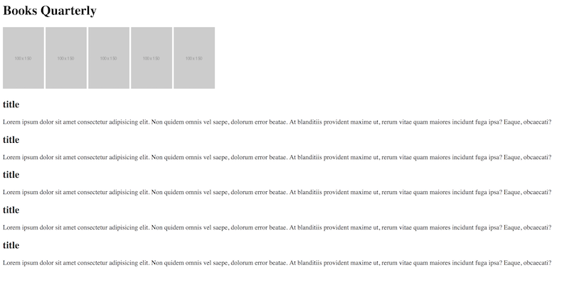

# Instructions

An activity to make your first website! The final design will be achieved through iterative activities.

But for now, we are just working on this layout:

Follow the steps below:

* Use HTML tags inside the `body` tag to add a primary heading that says "Books Quarterly".

* Add three to five bookcover images.

* Add three secondary headings with the books title.

* Add three paragraphs summarizing the books (one below each `h2`). You can use filler text.
